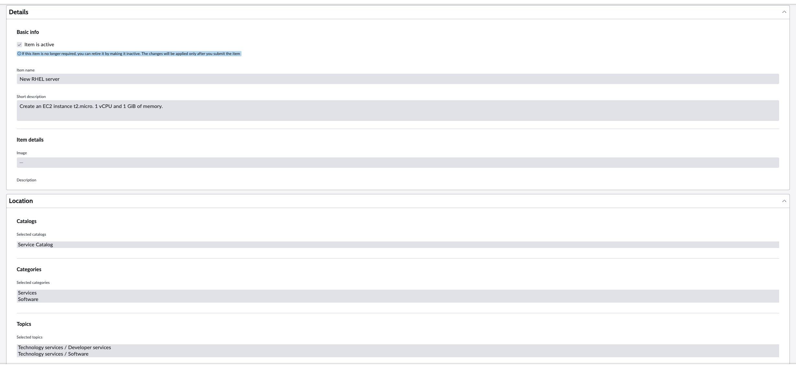
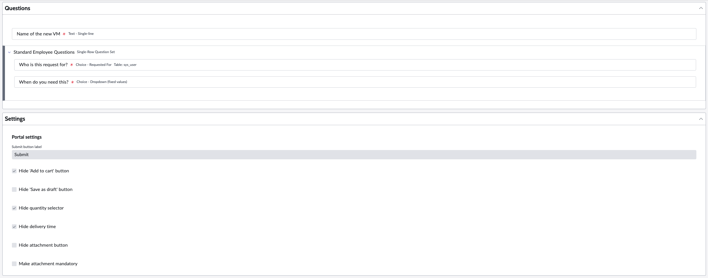
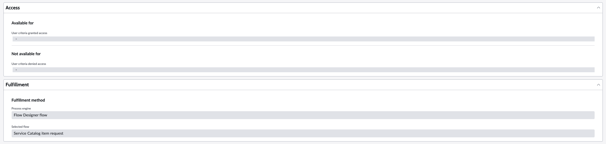
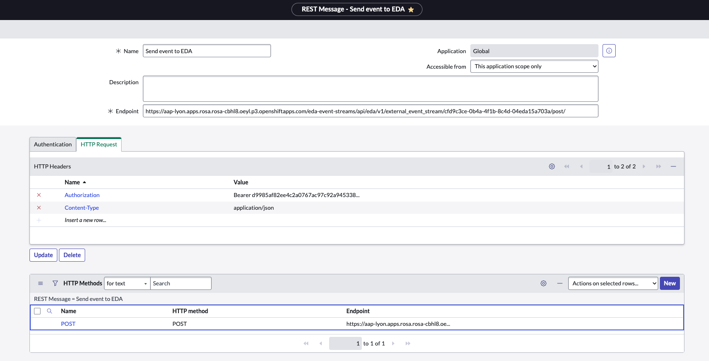
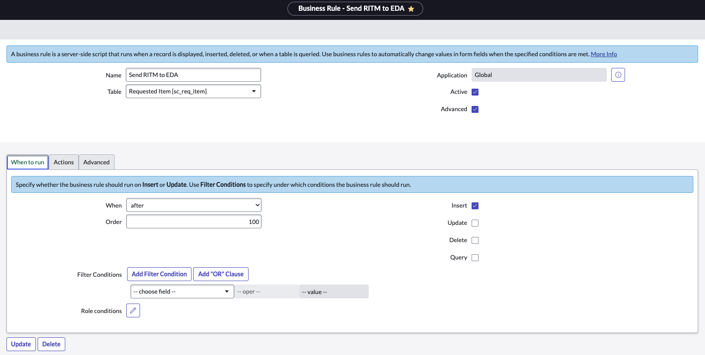

# Self-Service VM Provisioning with ServiceNow & Ansible EDA

## Prerequisites

1. Ansible Automation Platform deployed with both Controller and EDA components.
2. An active ServiceNow instance.

## Steps

### 1. Create a User in ServiceNow

This user will be assigned to each ServiceNow record created during the provisioning process.

1. Navigate to **User Administration > Users** in ServiceNow.
2. Click the purple **New** button.
3. Enter the required information, such as User ID and Email.


4. Click **Submit** to create the user.

### 2. Create the Service Catalog

1. Navigate to **Service Catalog > Catalog Builder** in ServiceNow.
2. Select **Create a new catalog item**.





### 3. Create the REST message

This will be used to send an event to EDA.

1. Navigate to **System Web Services > Outbound > REST Message** in ServiceNow.
2. Select **New**.



### 3. Create the REST message

This will be used to send an event to EDA.

1. Navigate to **System Definition > Business Rule** in ServiceNow.
2. Select **New**.



3. Use the following script to complete in the Advanced tab.

```javascript
(function executeRule(current, previous) {
	gs.info("Business Rule 'Send RITM to EDA' triggered for: " + current.number);
	var payload = {};
	var fields = new GlideRecordUtil().getFields(current);
	for(var field in fields) {
		var field_name = fields[field];
		var field_type = current.getElement(field_name).getED().getInternalType();
		if(field_name == 'variables') {
			continue;
		}
		else if(field_type == 'boolean' || field_type == 'journal_input') {
			var variable_display_value = current.getDisplayValue(field_name);
			if(variable_display_value) {
				payload[field_name] = variable_display_value;
			}
		}
		else {
			var variable_value = current.getValue(field_name);
			if(variable_value) {
				payload[field_name] = variable_value;
			}
		}
	}

	payload['variables'] = {};
    var variables = current.variables.getElements();
    for (var i=0; i<variables.length; i++) { 
        var question = variables[i].getQuestion();
		payload['variables'][question.getName()] = question.getValue();
    } 

	var REST_MESSAGE_NAME = "Send event to EDA";
	var request = new sn_ws.RESTMessageV2(REST_MESSAGE_NAME, "POST");
	var request_body = JSON.stringify(payload);
	request.setRequestBody(request_body);
	request.setTimeout(1000);
	request.execute();
})(current, previous);
```