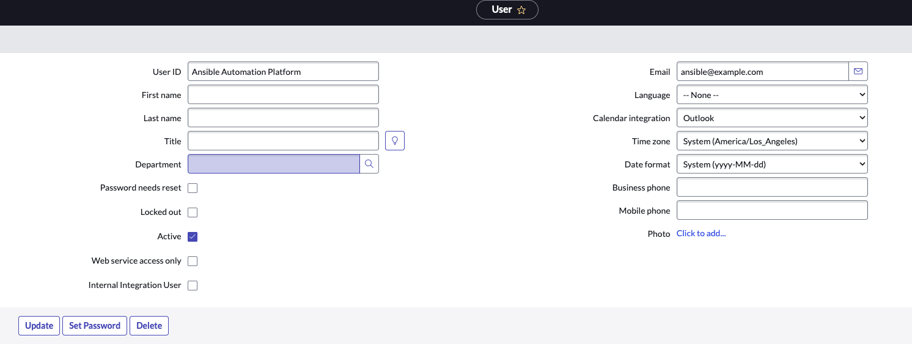

# Self-Service VM Provisioning with ServiceNow & Ansible EDA

## Prerequisites

1. Ansible Automation Platform deployed with both Controller and EDA components.
2. An active ServiceNow instance.

## Steps

### 1. Create a User in ServiceNow

This user will be assigned to each ServiceNow record created during the provisioning process.

1. Navigate to **User Administration > Users** in ServiceNow.
2. Click the purple **New** button.
3. Enter the required information, such as User ID and Email.

1. Click **Submit** to create the user.